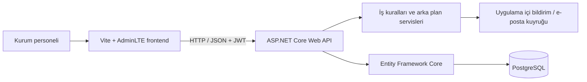
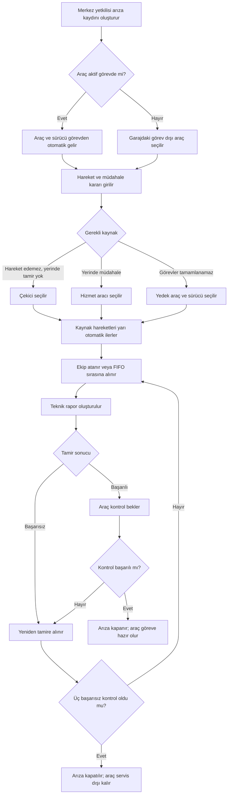

# İETT Arıza Yönetim Sistemi

İETT filosundaki araç arızalarının bildirilmesi, değerlendirilmesi, gerekli kaynakların yönlendirilmesi, teknik ekibin çalışması, tamir sonrası kontrol ve arızanın kapatılması süreçlerini tek merkezden yöneten kurum içi web uygulamasıdır.

Proje staj çalışması kapsamında örnek verilerle geliştirilmiştir. Gerçek kurum verisi içermez.

## Projenin amacı

- Araç arızalarını kayıt altına almak ve geçmişini korumak
- Aktif görevdeki veya garajdaki araçlar için uygun arıza akışını başlatmak
- Çekici, hizmet aracı, yedek araç, sürücü ve teknik ekip kaynaklarını yönetmek
- Arıza nedeniyle tamamlanamayacak görevleri başka araca devretmek
- Teknik rapor ve araç kontrolü tamamlanmadan arızanın hatalı biçimde kapatılmasını engellemek
- Garaj, araç, sürücü ve ekip bilgilerini rol kapsamına göre göstermek
- Kritik işlemleri değiştirilemez işlem kayıtlarında saklamak
- Uygulama içi bildirim ve isteğe bağlı e-posta bildirimi üretmek

## Kullanılan teknolojiler

### Backend

- ASP.NET Core 8 Web API
- C#
- Entity Framework Core 8 — Database First
- Npgsql PostgreSQL sağlayıcısı
- JWT tabanlı kimlik doğrulama
- ASP.NET Core Background Services
- Swagger / OpenAPI
- xUnit

### Frontend

- HTML5 ve CSS3
- AdminLTE 4
- Bootstrap 5
- Vanilla JavaScript — ES Modules
- Fetch API
- Chart.js
- SweetAlert2
- DataTables
- Vite

### Veritabanı

- PostgreSQL
- İlişkisel tablolar ve yabancı anahtarlar
- View, sequence, index, check constraint ve trigger yapıları
- JSONB işlem geçmişi alanları
- Audit log ve durum geçmişi tabloları

## Mimari

Frontend ve backend birbirinden bağımsızdır. Frontend, backend ile JSON tabanlı REST API üzerinden haberleşir. Backend iş kurallarını uygular ve Entity Framework Core aracılığıyla PostgreSQL veritabanına erişir.



## Kullanıcı rolleri

| Rol | Yetki kapsamı |
|---|---|
| Admin | Sistemin tamamını görür; kullanıcı, tanım, araç, garaj ve sistem ayarlarını yönetir. |
| Merkez Yetkilisi | Kurum genelindeki operasyonu görür; arıza açar, kaynakları seçer ve arıza sürecini yönetir. |
| Garaj Yetkilisi | Yalnızca kendi garajındaki araçları, sürücüleri, ekipleri ve arızaları görür; teknik rapor ve çalışan işlemlerini yönetir. |

Sürücüler ve teknisyenler sistemde çalışan kaydı olarak bulunur; doğrudan uygulamaya giriş yapmaz. Sayfa görünürlüğü ayrıca Sistem Ayarları ekranından rol bazında yönetilebilir.

## Ana modüller

- Dashboard
- Arızalar
- Görev ve Hat Planı
- Personel Olayları
- Araçlar
- Garajlar
- Sürücüler
- Teknik Ekipler
- Araç Kontrolleri
- Operasyon İzleme
- Çözüm Kütüphanesi
- Operasyon Olayları
- Kullanıcı Yönetimi
- İşlem Kayıtları
- Sistem Ayarları

## Arıza süreci



Araç mevcut seferini veya günün kalan görevlerini tamamlayabiliyorsa müdahale ilgili görevin bitişini bekler. Görevler yedek araca devredildiyse eski araç aktif görev listesinden çıkarılır. Yerinde müdahale başarılı olan araç eski görevine dönmez; garaja gider, kontrol edilir ve başarılı kontrolden sonra yeniden görev alabilir hâle gelir.

## Proje yapısı

```text
Arıza Yönetim Sistemi/
├── Backend/
│   ├── IettFaultManagement.Api/          # ASP.NET Core Web API
│   ├── IettFaultManagement.Api.Tests/    # xUnit testleri
│   └── IettFaultManagement.sln           # Visual Studio çözümü
├── Frontend/
│   ├── src/api/                           # REST API istemcileri
│   ├── src/auth/                          # JWT oturum yönetimi
│   ├── src/pages/                         # Sayfa davranışları
│   ├── src/styles/                        # Ortak tasarım
│   └── *.html                             # Çok sayfalı arayüz
├── database/
│   ├── migrations/                       # Veritabanı değişiklikleri
│   ├── seeds/                            # Örnek veri betikleri
│   ├── checks/                           # Veri bütünlüğü kontrolleri
│   └── iett_fault_management_schema.sql  # Ana şema
└── README.md
```

## Gereksinimler

- .NET 8 SDK
- PostgreSQL 12 veya üzeri
- Node.js ve npm
- Visual Studio 2022 veya Visual Studio Code
- İsteğe bağlı: pgAdmin

## Yerel kurulum

### 1. Veritabanı

PostgreSQL üzerinde uygulama kullanıcısını ve veritabanını oluşturun:

```sql
CREATE ROLE iett_fault_app WITH LOGIN PASSWORD 'GUCLU_BIR_PAROLA';
CREATE DATABASE iett_fault_management
    WITH OWNER = iett_fault_app ENCODING = 'UTF8';
```

Ardından `database/iett_fault_management_schema.sql` dosyasını ve ihtiyaç duyulan migration dosyalarını tarih sırasıyla çalıştırın. Ayrıntılar için [database/README.md](database/README.md) dosyasına bakın.

### 2. Backend sırları

Gerçek parolalar ve anahtarlar kaynak koda yazılmaz. Proje kök dizininde aşağıdaki komutları kendi değerlerinizle çalıştırın:

```powershell
dotnet user-secrets set "ConnectionStrings:DefaultConnection" "Host=localhost;Port=5432;Database=iett_fault_management;Username=iett_fault_app;Password=PAROLANIZ" --project .\Backend\IettFaultManagement.Api\IettFaultManagement.Api.csproj

dotnet user-secrets set "Jwt:Key" "EN-AZ-32-KARAKTER-UZUNLUGUNDA-GUVENLI-ANAHTAR" --project .\Backend\IettFaultManagement.Api\IettFaultManagement.Api.csproj
```

E-posta servisi kullanılacaksa SMTP bilgileri de User Secrets içinde tutulmalıdır:

```powershell
dotnet user-secrets set "Email:Enabled" "true" --project .\Backend\IettFaultManagement.Api\IettFaultManagement.Api.csproj
dotnet user-secrets set "Email:SenderAddress" "GONDEREN_ADRES" --project .\Backend\IettFaultManagement.Api\IettFaultManagement.Api.csproj
dotnet user-secrets set "Email:Smtp:Host" "SMTP_SUNUCUSU" --project .\Backend\IettFaultManagement.Api\IettFaultManagement.Api.csproj
dotnet user-secrets set "Email:Smtp:Username" "SMTP_KULLANICISI" --project .\Backend\IettFaultManagement.Api\IettFaultManagement.Api.csproj
dotnet user-secrets set "Email:Smtp:Password" "UYGULAMA_PAROLASI" --project .\Backend\IettFaultManagement.Api\IettFaultManagement.Api.csproj
```

### 3. Backend'i çalıştırma

```powershell
cd ".\Backend\IettFaultManagement.Api"
dotnet run --launch-profile http
```

- API: `http://localhost:5043`
- Swagger: `http://localhost:5043/swagger`
- Sağlık kontrolü: `http://localhost:5043/health`

### 4. Frontend'i çalıştırma

Farklı bir terminal açın:

```powershell
cd ".\Frontend"
npm install
npm run dev
```

Frontend `http://localhost:5173` adresinde çalışır. API adresi [Frontend/src/config/app-config.js](Frontend/src/config/app-config.js) dosyasında merkezi olarak tanımlanmıştır.

## Test ve doğrulama

Backend testleri:

```powershell
dotnet test .\Backend\IettFaultManagement.Api.Tests\IettFaultManagement.Api.Tests.csproj
```

Backend derlemesi:

```powershell
dotnet build .\Backend\IettFaultManagement.Api\IettFaultManagement.Api.csproj
```

Frontend üretim derlemesi:

```powershell
cd .\Frontend
npm run build
```

Son teslim kontrolünde:

- 27/27 otomatik test başarılıdır.
- Backend `0 hata, 0 uyarı` ile derlenmiştir.
- Frontend üretim derlemesi başarılıdır.
- Giriş, dashboard, ana modüller, arıza listesi, arıza formu ve detay ekranı canlı olarak doğrulanmıştır.
- Kritik veritabanı tutarlılık kontrollerinde sorun bulunmamıştır.

## Güvenlik notları

- Veritabanı parolası, JWT anahtarı ve SMTP parolası Git'e gönderilmez.
- Kullanıcı parolaları düz metin tutulmaz; hashlenmiş olarak saklanır.
- API işlemleri JWT ve rol kontrolleriyle korunur.
- Garaj yetkilisinin verileri kendi garajıyla sınırlandırılır.
- Kritik ekleme, güncelleme ve pasifleştirme işlemleri audit log sistemine yazılır.
- Dosya yüklemelerinde uzantı, MIME türü ve boyut kontrolü uygulanır.

## Proje durumu

Backend, frontend ve veritabanı geliştirmeleri tamamlanmıştır. Uygulama staj sunumu ve kurum içi demo amacıyla hazırdır.

---

**Geliştiren:** Mehmet Gürbey  
**Proje:** İETT Bilgi İşlem Dairesi — Akıllı Ulaşım Sistemleri staj çalışması  
**Yıl:** 2026
