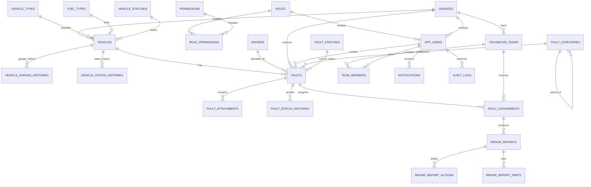

# İETT Araç Arıza Yönetim Sistemi — PostgreSQL Veritabanı Tasarımı

Bu klasör, staj projesinin PostgreSQL veritabanı şemasını ve kurulum sırasını içerir.

## Sistem özeti

1. Şoför, arızayı telefonla merkez yetkilisine bildirir.
2. Merkez yetkilisi kapı numarasıyla aracı, sicil numarasıyla şoförü bulur ve arıza kaydı açar.
3. Arıza, aracın kayıtlı olduğu garaja otomatik yönlendirilir.
4. Merkez yetkilisi uygun teknik ekibi seçer; ekip yoksa kayıt FIFO bekleme sırasına alınır.
5. Garaj yetkilisi, teknisyen ekibinin yaptığı işlemleri teknik rapor olarak sisteme girer.
6. Merkez yetkilisi rapora göre arızanın ve aracın durumunu günceller; arızayı kapatabilir veya yeniden açabilir.
7. Durum değişiklikleri geçmiş tablolarında, kritik işlemler `audit_logs` tablosunda tutulur.
8. Kayıtlar fiziksel olarak silinmez; gerekçeyle pasife alınır.

## Roller

| Rol | Temel sorumluluk |
|---|---|
| Admin | Kullanıcı, rol, yetki ve tanımları yönetir; tüm kayıtları ve audit loglarını görür. |
| Merkez Yetkilisi | Arıza açar, şoför ve aracı bağlar, raporu değerlendirir ve durumu yönetir. |
| Garaj Yetkilisi | Yalnızca kendi garajındaki araç, çalışan, arıza ve ekip süreçlerini takip eder; teknik raporu girer. |

Her kullanıcıya yalnızca bir rol atanır. Uygulamaya Admin, Merkez Yetkilisi ve Garaj Yetkilisi giriş yapar. Sürücü ve teknisyenler kullanıcı hesabı değil çalışan kaydı olarak tutulur.

## ER diyagramı



## Tablo grupları

| Grup | Tablolar |
|---|---|
| Yetkilendirme | `roles`, `permissions`, `role_permissions`, `app_users` |
| Organizasyon | `garages`, `drivers` |
| Araç | `vehicle_types`, `fuel_types`, `vehicle_statuses`, `vehicles`, `vehicle_garage_histories`, `vehicle_status_histories` |
| Arıza | `fault_categories`, `fault_statuses`, `faults`, `fault_attachments`, `fault_status_histories` |
| Tamir | `technician_teams`, `team_members`, `fault_assignments`, `repair_reports`, `repair_report_actions`, `repair_report_parts` |
| Sefer görevleri | `routes`, `service_tasks`, `task_assignments`, `task_transfer_batches` |
| Sistem | `notifications`, `audit_logs` |

## Önemli tasarım kararları

- Kapı numarası araç için benzersiz ana iş kimliğidir; teknik birincil anahtar yine `id` alanıdır.
- Marka ve model, araç eklenirken `vehicles.brand` ve `vehicles.model` alanlarına metin olarak girilir.
- Garaj kapasitesi `garages.vehicle_capacity` alanında araç adedi olarak tutulur; mevcut doluluk garaja bağlı aktif araçlardan hesaplanır.
- Kategori ve alt kategori aynı `fault_categories` tablosunda `parent_category_id` ile tutulur.
- Arıza kaydı, arıza anındaki garajı ve kilometreyi ayrıca saklar. Araç sonradan değişse bile geçmiş bozulmaz.
- Aynı araç için eş zamanlı yalnızca bir açık arıza oluşturulabilir.
- Aynı arızada aynı anda yalnızca bir aktif ekip ataması olabilir.
- Bir teknisyen aynı anda yalnızca bir aktif ekip üyesi olabilir.
- Garaj yetkilisi teknik raporu girer; arızanın resmî durumunu merkez yetkilisi yönetir.
- Başarıyla tamamlanan kayıt `Kapatıldı`, hatalı/geçersiz kayıt `is_active = false` olur.
- `audit_logs.old_values` ve `new_values`, PostgreSQL `jsonb` tipindedir.
- Tarihler saat dilimi kaybını önlemek için `timestamptz` olarak tutulur.
- Şifre hiçbir zaman düz metin tutulmaz; .NET Identity tarafından hashlenir.

## PostgreSQL kurulumu — adım adım

### 1. PostgreSQL ve pgAdmin kurulumu

PostgreSQL'i kurarken sunucu parolasını güvenli şekilde kaydedin. Varsayılan port `5432` olarak kalabilir. pgAdmin, veritabanını grafik arayüzden yönetmek için kullanılabilir.

### 2. Veritabanı ve sınırlı uygulama kullanıcısı oluşturma

Bu komutları `postgres` yönetici hesabıyla çalıştırın. Parolayı gerçek ortamda değiştirin:

```sql
CREATE ROLE iett_fault_app
    WITH LOGIN
    PASSWORD 'GELISTIRME_ICIN_GUCLU_BIR_PAROLA';

CREATE DATABASE iett_fault_management
    WITH OWNER = iett_fault_app
         ENCODING = 'UTF8';
```

Uygulamayı `postgres` süper kullanıcısıyla çalıştırmayın.

### 3. Şema dosyasını çalıştırma

pgAdmin ile:

1. `iett_fault_management` veritabanını seçin.
2. **Query Tool** ekranını açın.
3. `iett_fault_management_schema.sql` dosyasını açın.
4. Execute düğmesine basın.
5. İşlem sonunda `COMMIT` ve başarı mesajını kontrol edin.

`psql` ile:

```powershell
psql -U iett_fault_app -d iett_fault_management -f .\database\iett_fault_management_schema.sql
```

### 4. Kurulumu doğrulama

```sql
SELECT table_name
FROM information_schema.tables
WHERE table_schema = 'fault_management'
ORDER BY table_name;

SELECT * FROM fault_management.roles ORDER BY id;
SELECT * FROM fault_management.fault_statuses ORDER BY display_order;
SELECT * FROM fault_management.vehicle_statuses ORDER BY display_order;
```

Beklenen sonuç: `fault_management` altında 29 tablo ve başlangıç rol/durum kayıtları.

Şema, kısmi benzersiz indeksler kullandığı için PostgreSQL 12 ve sonrası sürümlerle uyumludur. Yeni bir proje için güncel desteklenen PostgreSQL sürümünün kullanılması önerilir.

### 5. .NET bağlantı cümlesi

`appsettings.Development.json` örneği:

```json
{
  "ConnectionStrings": {
    "DefaultConnection": "Host=localhost;Port=5432;Database=iett_fault_management;Username=iett_fault_app;Password=GELISTIRME_ICIN_GUCLU_BIR_PAROLA"
  }
}
```

Parolayı Git deposuna göndermeyin. Gerçek geliştirmede .NET User Secrets veya ortam değişkeni kullanın.

### 6. EF Core notu

Uygulamada önerilen paketler:

```powershell
dotnet add package Npgsql.EntityFrameworkCore.PostgreSQL
dotnet add package Microsoft.EntityFrameworkCore.Design
dotnet add package Microsoft.AspNetCore.Identity.EntityFrameworkCore
```

Bu SQL dosyası yetkiliye sunulabilecek doğrudan veritabanı tasarımıdır. Uygulama geliştirilirken aynı model EF Core entity sınıfları ve Fluent API ile tanımlanıp migration üretilebilir. Üretimde hem SQL dosyasını hem EF migration'ı birbirinden bağımsız şekilde aynı veritabanına uygulamayın; şema sahibi olarak tek yöntem seçin.

## Uygulama kuralları

Veritabanı ilişkileri verinin bütünlüğünü korur; aşağıdaki kurallar ayrıca .NET servis katmanında uygulanmalıdır:

1. Arıza açılınca garaj, aracın güncel garajından alınır.
2. Ekip seçiminde aynı garajdaki aktif ve işi olmayan ekipler değerlendirilir.
3. Yetkili ekip seçmezse veya uygun ekip yoksa arıza FIFO bekleme sırasına alınır.
4. İlk boşalan uygun ekip bekleme sırasındaki ilk arızaya atanır.
5. Garaj yetkilisi sadece kendi `garage_id` değerine ait kayıtları görür.
6. Garaj yetkilisi yalnızca kendi garajındaki ekipleri ve rapor süreçlerini yönetir.
7. Durum değişikliğinde açıklama ve `fault_status_histories` kaydı zorunludur.
8. Kritik create/update/deactivate işlemleri `audit_logs` tablosuna yazılır.
9. Pasifleştirme nedeni zorunludur; fiziksel `DELETE` operasyon ekranlarında kullanılmaz.
